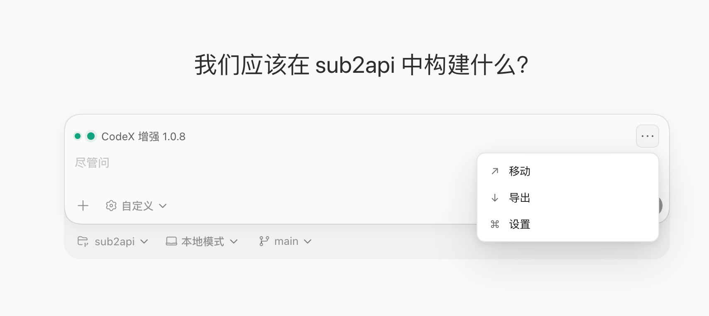
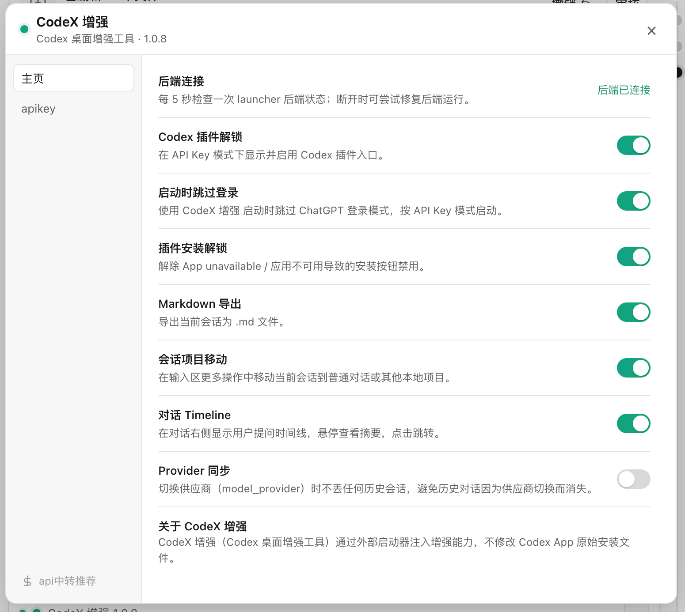
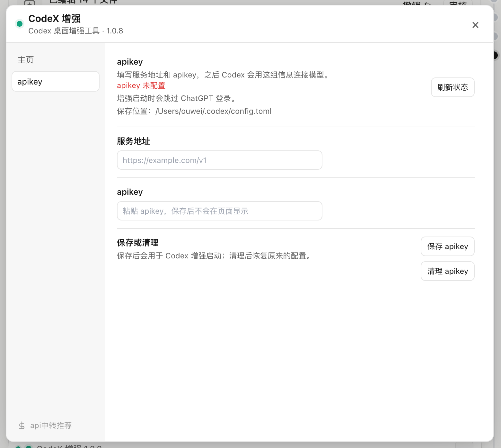
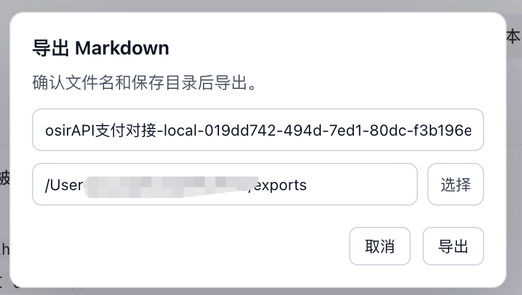

# CodeX 增强

<p align="center">
  
  
  
</p>

CodeX 增强是一个 Codex 桌面增强工具。它通过外部启动器给 Codex 注入增强能力，不修改 Codex App 原始安装文件。

适合已经使用 API Key / 中转 provider 启动 Codex 的场景：可以跳过 ChatGPT 登录模式，并补齐插件入口、会话导出、项目移动、状态重连等常用能力。

## 功能

| 功能 | 说明 |
| --- | --- |
| 插件入口解锁 | API Key 模式下显示并启用 Codex 原生插件入口。 |
| 插件安装解锁 | 解除 App unavailable / 应用不可用导致的安装按钮禁用。 |
| 启动时跳过登录 | 通过增强启动时按 API Key / 中转模式启动 Codex，不要求 ChatGPT 登录。 |
| apikey 配置 | 在设置面板中填写服务地址和 apikey，写入本机 `~/.codex/config.toml`。 |
| Markdown 导出 | 在输入框上方三点菜单中导出当前会话为 `.md` 文件。 |
| 会话项目移动 | 在输入框上方三点菜单中把当前会话移动到普通对话或其他本地项目。 |
| 对话 Timeline | 在对话区域右侧显示用户提问时间线，悬停查看摘要，点击跳转。 |
| Provider 同步 | 切换 `model_provider` 后尽量保持历史会话可见。 |
| 后端状态与重连 | 输入框上方显示在线状态，断开后可点击状态点/文字重连。 |

说明：Codex 移动版依赖 ChatGPT 登录态和远程控制接口，API Key / 中转跳登录模式下无法真正完整解锁，因此本工具不会把它作为可开启功能展示。

## 界面预览

输入框上方会显示 CodeX 增强状态和三点操作入口，可直接打开移动、导出、设置。



设置面板集中管理插件解锁、跳过登录、导出、移动、Timeline 和 Provider 同步等开关。



## 快速使用

### 方式一：让 Codex 帮你安装

你可以把这个项目仓库发给 Codex，然后直接让 Codex 执行：

```text
请帮我安装这个项目，并在本机生成 CodeX 增强启动入口。
```

Codex 一般会在项目目录里完成依赖安装，并执行下面的安装命令。

### 方式二：命令行安装

进入项目目录后执行：

```bash
python -m pip install -e .
python -m codex_session_delete setup
```

macOS 安装完成后会生成：

```text
/Applications/CodeX 增强.app
```

Windows 安装完成后会生成桌面快捷方式：

```text
CodeX 增强.lnk
```

### 方式三：临时启动一次

如果只想临时启动，不安装 App / 快捷方式：

```bash
python -m pip install -e .
python -m codex_session_delete unlock
```

这个命令会启动 Codex 并注入增强能力。使用期间保持终端窗口打开即可。

## 后续统一入口

安装完成后，请统一通过增强入口启动 Codex：

| 系统 | 启动入口 |
| --- | --- |
| macOS | `/Applications/CodeX 增强.app` |
| Windows | 桌面 `CodeX 增强.lnk` |
| 命令行 | `python -m codex_session_delete unlock` |

不要直接打开原版 Codex App，否则增强 UI 和本地 helper 不会注入。

## apikey 配置

启动 CodeX 增强后，在输入框上方点击三点按钮，进入：

```text
设置 -> apikey
```



填写：

- 服务地址：例如 `https://example.com/v1`
- apikey：你的中转或模型服务密钥

保存后，配置会写入本机：

```text
~/.codex/config.toml
```

之后从 CodeX 增强入口启动 Codex，会按 API Key / 中转模式启动，并跳过 ChatGPT 登录模式。

也可以用命令行配置：

```bash
export CODEX_PLUS_RELAY_API_KEY="sk-..."
python -m codex_session_delete relay-apply --base-url "https://example.com/v1"
python -m codex_session_delete relay-status
python -m codex_session_delete relay-clear
```

## 日常操作

增强启动后，对话输入框上方会出现状态和三点操作区：

- 点击状态点或 `CodeX 增强` 文字：检查并尝试重连增强后端。
- 点击三点按钮：打开移动、导出、设置。
- 导出：确认文件名和目录后导出 Markdown。
- 移动：选择普通对话或本地项目。
- 设置：管理插件解锁、导出、移动、Timeline、Provider 同步、apikey 等开关。



## 常用命令

```bash
# 安装当前项目
python -m pip install -e .

# 启动增强版 Codex
python -m codex_session_delete unlock

# 安装统一入口
python -m codex_session_delete setup

# 卸载统一入口
python -m codex_session_delete remove

# 检查更新 / 更新
# 如需使用 Release 更新，请先设置 CODEX_PLUS_UPDATE_REPOSITORY=owner/repo
python -m codex_session_delete check-update
python -m codex_session_delete update
```

## 常见问题

### 启动后没有看到增强入口

请确认是通过 `/Applications/CodeX 增强.app`、桌面 `CodeX 增强.lnk` 或 `python -m codex_session_delete unlock` 启动。

### 输入框上方状态显示断开

点击状态点或 `CodeX 增强` 文字即可尝试重连。仍失败时查看：

```text
~/.codex-session-delete/launcher.log
```

### 切换 provider 后历史对话不见了

打开设置，启用 `Provider 同步`，然后重新从 CodeX 增强入口启动 Codex。

### Codex 移动版为什么不显示

Codex 移动版需要 ChatGPT 登录态和官方远程控制接口。API Key / 中转跳登录模式下无法完整使用，所以增强工具不会强行展示这个入口。

## 交流反馈

欢迎加入 `CodeX 增强用户交流群`，交流安装使用、apikey 配置、功能建议和问题反馈。

添加微信：`duo112311`

备注：`CodeX 增强`

备注后会自动拉群。


## 说明

CodeX 增强只做本机增强注入，不修改 Codex App 安装文件。Codex App 后续更新如果改变页面结构，可能需要同步更新注入脚本。
